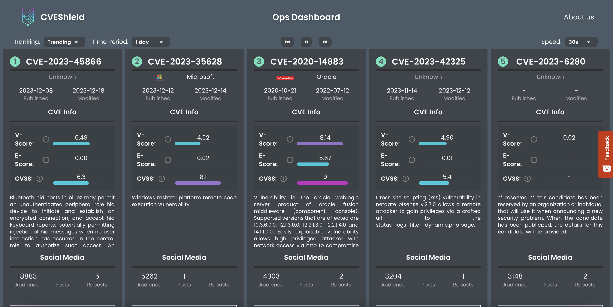

# CVEFree

Repository providing a link to a snapshot of all CVE vulnerability data along with documentation and notebooks to get started handeling and visualising the data. This data is mostly dependant on OSINT and collated together in one place by Kaze. The latest vulnerability data is currently updated on a bi-weekely basis.
<p style="text-align: right">  </p>

# Getting the data

In the comprehensive form we publish the vulnerability data, it is too large to be held and updated on github*. Therefore, you will need to download the full file from our servers. You can use the following curl command to download the file:

```
curl https://kazepublic.blob.core.windows.net/cvefree/data.json --output data.json
```

*We are open to the idea of breaking down the CVE data per year or month into the repository itself if there is demand for it.

# Data Fields

| Commit | Type | Description |
| ----------- | ----------- | ----------- |
|cve	| String |	Official unique identifier for vulnerabilities published by the NVD|
|last_modified_datetime	|timestamp	|Time of last modification|
|published_datetime	|timestamp	|Time CVE was published by National Vulnerability Database (or other). |
|description	|String	|Official description for the CVE published by the NVD.|
|vendors	|[String]	|List of vendors effected by the CVE.|
| cvssv2	|Decimal [0.0-10.0]	|Version 2 of the official defacto severity scoring of CVEs, produced by "experts" filling out ordinal scales. Can use Version 2 as compromise if version 3 doesn't exist.|
|cvssv3	|Decimal [0.0-10.0]	|Version 3 of the official defacto severity scoring of CVEs, produced by "experts" filling out ordinal scales. Use Version 3 over 2 when possible.|
|epss	|Decimal [0.0-1.0]	|Predictive score that a CVE is exploited in the next 30 days, produced by a gradient boosted machine learning model.|
|v_score	|decimal [0.0-1.0]	|Proprietary vulnerability score - Taking a holistic view of vulnerability landscape.|
|cti_count	|Number	|Count of the number of times a CVE has been found in a collection of monitored cyber threat intelligence report and articles feeds.|
|social_media_audience	|Number	|Estimate for the number of people who have seen a CVE being discussed on social media platforms (currently Twitter & Reddit).|
|software_cpes	|[String]	|List of the CPEs that are effected by the CVE vunlreabuility. CPE is the common platform enumeration, a standard for identifying software and hardware. (Currently file too large for github, use alternative storage end-point to get this).|
|cisa	|Boolean	|Flag to highlight vulnerabilities with exploits cound in CISA KEV|
|metasploit	|Boolean	|Flag to highlight vulnerabilities with exploits cound in the metasploit framework.|

# Visualising the data

Navigate the notebooks in [```notebooks/```](notebooks) and open and run them for basic visulisations. You can begin doing any processing or visualisation of this data in any prefered language by parsing the downloaded ```data.json``` file.

# CVEShield

Kaze uses a live version of this data in their free-to-use app at [www.cveshield.com]()

[](www.cveshield.com)

# Use Cases

* __Effective Vulnerability Prioritisation Using V-Score:__ 
Organisations can leverage the V-Score to prioritise patching efforts based on the risk profile of each vulnerability.
* __Vulnerability Trend Analysis:__ 
Analysts can use the dataset to spot emerging trends in vulnerabilities and develop preventive strategies.
* __Social Media Trending:__
By monitoring CVE discussions on social media, security professionals can gauge public awareness and sentiment, potentially identifying zero-day exploits as they emerge.
* __Software to Vulnerability Matching:__
IT departments can match their software inventory against the CVE list to quickly identify potential exposures.

# License

CVEFree is released under *Unlicense* license. Please see [LICENSE](LICENSE) for details.